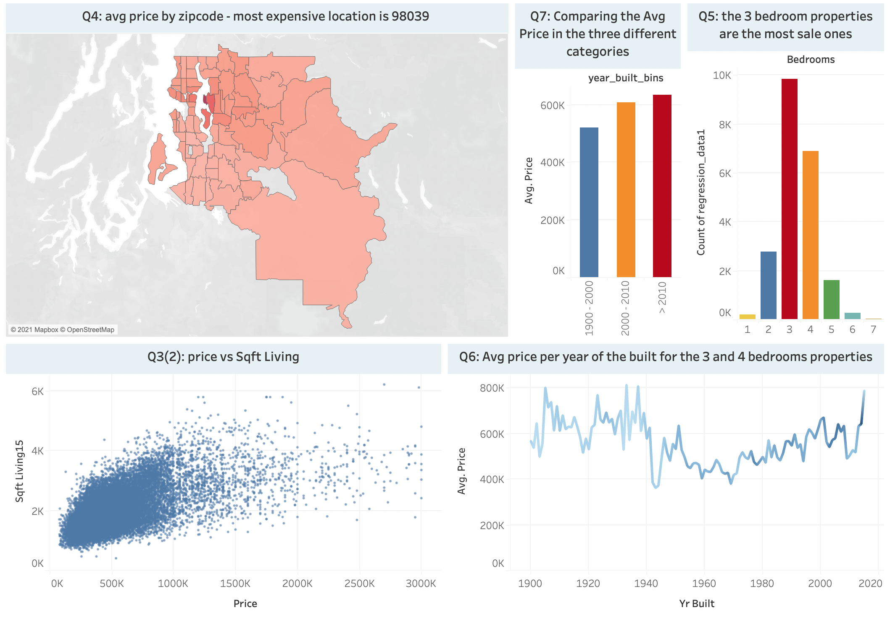

# Case Study: Regression 🏡
by [Maziar Mehrbakhsh](https://github.com/Maziar-Mehr) & [Virgilio Oñate](https://github.com/vonate5), November 2021
## Building a machine learning model to predict the selling prices of houses based on a variety of features

## Table of content
- [Project Brief](https://github.com/vonate5/midterm_project/blob/main/README.md#project-brief)
- [Data](https://github.com/vonate5/midterm_project/blob/main/README.md#data)
- [Process & tools](https://github.com/vonate5/midterm_project/blob/main/README.md#process--tools)
- [Visualization](https://github.com/vonate5/midterm_project/blob/main/README.md#visualization)
- [Results](https://github.com/vonate5/midterm_project/blob/main/README.md#results)

## Project Brief
**Scenario:**
We are working as an analyst for a real estate company. Your company wants to build a machine learning model to predict the selling prices of houses based on a 
variety of features on which the value of the house is evaluated.

**Challenge:**
Use the given data set to build a model that will predict the price of a house based on features provided in the dataset.

**Problem:**
Senior management also wants to explore the characteristics of the houses using some business intelligence tools. One of those parameters includes understanding 
which factors are responsible for higher property value - $650K and above.

Further project details such as deliverables can be found [here](https://github.com/ironhack-edu/data_mid_bootcamp_project_regression)

## Data
Leveraging on the [data](https://github.com/vonate5/midterm_project/tree/main/data_sets) we were provided with, we used Tableau's and Python's data visualisation tools to explore the relationships between features.    
To find out more about the distribution of the important features we highlighted, you can have a look on our Tableau dashboard below:

For further information you may find the Tableau data [here](https://github.com/vonate5/midterm_project/tree/main/tableau)

## Process & tools
### We use the following tools to achieve the objective.

- **MySQL:** we use MySQL to complete the SQL [questions](https://github.com/vonate5/midterm_project/blob/main/project_details/sql_questions_regression.md). You can find the answers [here](https://github.com/vonate5/midterm_project/tree/main/sql).
- **Trello:** set up our Trello board to help us organized and complete the daily tasks.
- **Tableau:** here you can find the Tableau [questions](https://github.com/vonate5/midterm_project/blob/main/project_details/tableau_regression.md).You can find the Tableau worksheets and dashboard [here](https://github.com/vonate5/midterm_project/tree/main/tableau).
- **Python:** programming language we use to build the Machine Learning model that give us the 84% accuracy of the price prediction. You can find de here the [code].
- **Data cleaning:** keeping the highly correlated features with price and dropping highly correlated features with eachother when they have the same meaning.
- **Machine Learning:**

## Visualization
You can see the full visualization we've done in [Tableau 📊](https://github.com/vonate5/midterm_project/tree/main/tableau) or the [Presentation]

## Results

#### Our model can predict by the 84.4% of accuracy the price of a house based on features. 

#
**Thanks for reading,**

If you have any question please reach out to us,  
Team 🇮🇷🇪🇸

